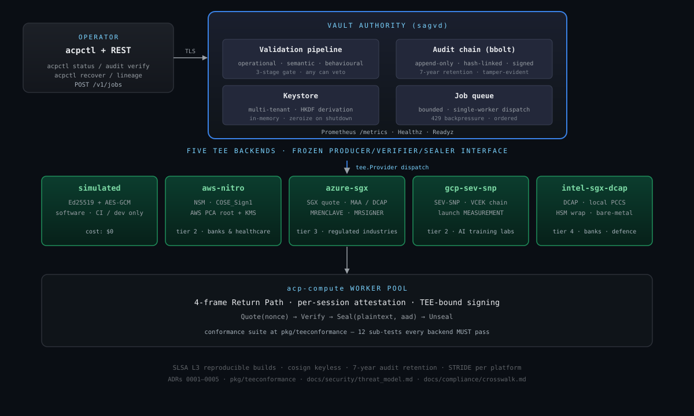

# AI Continuity Platform — Core

[](https://github.com/vault-genome/vaultgenome-core/actions/workflows/vault-gate.yml)
[](https://github.com/vault-genome/vaultgenome-core/actions/workflows/codeql.yml)
[](https://scorecard.dev/viewer/?uri=github.com/vault-genome/vaultgenome-core)
[](https://github.com/vault-genome/vaultgenome-core/releases)
[](docs/operator/05_release_procedure.md)
[](go.mod)
[](LICENSE)

**A fine-tuned AI model that survives the loss of the machine it runs on —
and comes back only where an operator-signed policy admits, on hardware that
proves what it is, behind a signed gate that proves the model works.**

The platform seals a model as a **genome** — the base model's hash, the
fine-tune as a sealed delta, and the deterministic recipe that produced it —
instead of a copy of the weights: 2.2 MB for a 0.5B model, one 447th of its
weights; 33.6 MB for a 32B model. The genome's key is released only to a
destination that attests with its chip (AMD SEV-SNP, Intel TDX, or an NVIDIA
H100 in confidential-computing mode) under a policy the operator signed in
advance; the destination restores the model itself, the authority gates it
(EXACT / EQUIVALENT / FAIL, signed), and every decision is on a signed,
hash-chained audit log before it takes effect. It is governance-first
infrastructure for AI continuity through catastrophic loss, including war:
a legal-authority problem first, a cryptographic-integrity problem second,
a computation problem third.

## Measured on real hardware

Every number links to the claim, its evidence files and the command that
reproduces it ([`VERIFIABLE-CLAIMS.md`](VERIFIABLE-CLAIMS.md), C1–C26).

| What | Result | Claim |
| - | - | - |
| A model under attack on a SEV-SNP VM fails over to another SEV-SNP VM | detect 2.53 s, RPO 9.0 s, **RTO 16.81 s**, the clean generation gated **EXACT** | [drill](docs/CONTINUITY-DRILL.md), [C14](VERIFIABLE-CLAIMS.md#c14) |
| The same failover to an Azure **confidential GPU** across the Internet | key released on the chip's report, the vTPM's quote and NVIDIA's tokens; **RTO 24.99 s**, EQUIVALENT on the H100 | [C18](VERIFIABLE-CLAIMS.md#c18) |
| The same failover to an **Intel TDX** Trust Domain | key released on Intel's word for the platform, TDX module and QE; **RTO 24.09 s** | [C21](VERIFIABLE-CLAIMS.md#c21) |
| Eight policies against one attack | **seven refused** for seven stated reasons, one move to the generation whose bytes match the sentinel's word | [C22](VERIFIABLE-CLAIMS.md#c22) |
| A **32B** model through the genome path on a confidential H100 | fine-tuned, sealed, restored and gated **EXACT** (16/16) over the Return Path | [C26](VERIFIABLE-CLAIMS.md#c26) |
| A 7B genome on one GPU | 10 MB against 15 GB of weights (1 : 1 502), EXACT on the pinned runtime, the recipe replaying bit for bit | [C16](VERIFIABLE-CLAIMS.md#c16) |
| The integer door across CPU and GPU | **the same bytes** on an Intel Xeon and an NVIDIA L4, at 0.5B and 7B, at zero tolerance | [C19](VERIFIABLE-CLAIMS.md#c19) |
| The GPU evaluated by this verifier, not only by NVIDIA | the H100's report, chain, firmware id, every measurement against NVIDIA's signed manifests, revocation asked of NVIDIA's responder; on the audit record | [C20](VERIFIABLE-CLAIMS.md#c20) |
| No secret file bare on a host | the escrow key sealed to the chip or the vTPM; seeds, TLS keys, tokens and the sentinel's seed sealed in place; a sealed file on another chip does not open | [C23](VERIFIABLE-CLAIMS.md#c23), [C24](VERIFIABLE-CLAIMS.md#c24), [C25](VERIFIABLE-CLAIMS.md#c25) |

What we do **not** claim is listed just as carefully:
[what we do not claim](VERIFIABLE-CLAIMS.md#what-we-do-not-claim),
[`KNOWN_ISSUES.md`](KNOWN_ISSUES.md), [`ROADMAP.md`](ROADMAP.md).

## Quickstart

**Five minutes, no cloud, no TEE hardware, no config.** The demo runs the real
platform code with a simulated TEE (it says so in its output):

```bash
git clone https://github.com/vault-genome/vaultgenome-core.git
cd vaultgenome-core
go run ./cmd/acp-demo
```

It seals a sample genome, receives it on a second "node", regenerates it and
prints an Ed25519-signed equivalence verdict: **EXACT** on a pinned runtime;
a simulated cross-hardware float drift falling through to the byte-portable
**integer path** (EQUIVALENT); and a **corrupted genome blocked**, fail-closed.
Or with Docker: `docker build -t vaultgenome . && docker run --rm vaultgenome`.
Point it at your own file for a byte-exact sealed-continuity proof:
`go run ./cmd/acp-demo --model ./path/to/your-model.safetensors`.

**Protect a real model with the CLI** — seal it into a portable `.genome`
bundle whose key is not in the file, move it, restore it byte-exact, and
keep a validated version chain:

```bash
make build                                                   # ./bin/acpctl and the daemons
./bin/acpctl genome seal --content-dir=./my-model --output=gen-0.genome --key-out=gen-0.key
./bin/acpctl genome seal --content-dir=./adapter-1 --parent=gen-0.genome --output=gen-1.genome --key-out=gen-1.key
# on another server, with the bundles and the key file copied over:
./bin/acpctl genome rewind --bundle=gen-0.genome --key-file=gen-0.key --target=./restored
./bin/acpctl genome chain  --dir=.
```

Opening authenticates every 1 MiB segment before a byte of it is used and
leaves the target untouched on any refusal: an edited, truncated or
wrong-key bundle changes nothing.

**Prerequisites.** Go 1.26 for the binaries. The `acp-compute` worker and
the hardware kits also need Python 3.11+ with the pinned runtime in
[`workers/genome/requirements.txt`](workers/genome/requirements.txt)
(torch 2.7.1); a vTPM host (Intel TDX, the Azure confidential GPU VM) needs
`tpm2-tools`.

## Deploy

| Path | Start here |
| - | - |
| **A real deployment on confidential VMs** — the authority, a worker, a destination, the policies, the keys | [`docs/operator/`](docs/operator/00_overview.md): [preflight](docs/operator/01_preflight.md) (keys and `seal-keys`), [cross-cloud restore](docs/operator/06_cross_cloud_restore.md), [failover](docs/operator/07_failover.md), and the real-TEE runbooks for [SEV-SNP](docs/operator/runbooks/real-tee-sev-snp.md), [TDX](docs/operator/runbooks/real-tee-tdx.md) and the [Azure confidential GPU](docs/operator/runbooks/real-tee-azure-cgpu.md) |
| **Reproduce a hardware claim** — one command boots the machines, runs the drill, collects the evidence and deletes everything | [`scripts/hardware-test/`](scripts/hardware-test/): each kit's README names the machines, the cost and the time of a run (a failover drill: two SEV-SNP VMs, about 25 minutes; the H100 runs: one NCC H100 v5 VM at about $9 an hour) |
| **Run the pieces locally** — the daemons on the simulated TEE, with Docker Compose | [`deploy/compose/`](deploy/compose/README.md) |

Every binary reads its secrets from files it seals to the host it runs on:
run `sagvd seal-keys`, `acp-compute seal-keys` and `acp-bootstrap seal-keys`
once after provisioning ([ADR 0023](docs/adr/0023-the-daemons-key-files-sealed-to-the-host.md)).

## Verify a release

Releases are cut by [`release.yml`](.github/workflows/release.yml) from a tag
signed by a key pinned in [`.github/allowed_signers`](.github/allowed_signers):
four binaries built reproducibly, each with a keyless cosign signature and a
transparency-log entry, an SPDX SBOM, and a SLSA level 3 provenance
attestation. Check what you downloaded before you run it:

```bash
cosign verify-blob --signature sagvd.sig --certificate sagvd.cert \
  --certificate-identity-regexp '^https://github\.com/vault-genome/vaultgenome-core/\.github/workflows/release\.yml@refs/tags/v' \
  --certificate-oidc-issuer https://token.actions.githubusercontent.com sagvd
slsa-verifier verify-artifact sagvd --provenance-path multiple.intoto.jsonl \
  --source-uri github.com/vault-genome/vaultgenome-core --source-tag v0.2.1
git verify-tag v0.2.1
```

[`docs/operator/05_release_procedure.md`](docs/operator/05_release_procedure.md)
is the whole procedure; [`docs/security/supply_chain.md`](docs/security/supply_chain.md)
says what each check proves.

## How it works



Five binaries, one flow. The nine governed stages — Recovery Request →
Trust Admission → Trusted Session → Staged Disclosure → Delegated External
Compute → Return Path → Validation → Release Decision → Audit — are library
code under `internal/`, and `sagvd` drives them for every job
([ADR 0015](docs/adr/0015-one-binary-drives-the-nine-stages.md)).

| Binary | Role |
| - | - |
| `sagvd` | The authority. Releases a genome's key only to an attested destination the policy admits, gates every restore, confirms it, and writes every decision to the signed, hash-chained audit log before it takes effect. Runs the operator's REST API and the Return Path. |
| `acp-compute` | The worker. Dials the authority over mutual TLS, attests with its chip, restores the sealed genome's model in memory and answers the genome's own reference prompts; nothing of the genome touches its disk. |
| `acp-bootstrap` | The destination of a cross-cloud key release. Attests, receives the key, restores the genome, proves the model works through the door, signs a receipt with its TEE. |
| `acpctl` | The operator's CLI: seal, open and verify genomes; the sentinel that keeps a running model sealed and reports an intrusion; policies, stop lists, escrow ceremonies, audit verification. |
| `acp-demo` | The one-command demonstration above. |

A sentinel on the primary seals every new state of a running model with its
key escrowed to the authority and attests every record with the primary's
chip; when a tripwire fires, the authority moves the last clean generation
to the one standby the operator's policy names, and confirms it by the
standby's TEE-signed gate verdict
([ADR 0012](docs/adr/0012-sentinel-and-policy-driven-failover.md),
[ADR 0017](docs/adr/0017-limits-on-the-primarys-word.md)). The determinism
ladder finds a door that reproduces the sealed references — pinned float,
reproducible float, or the byte-portable integer forward
([ADR 0008](docs/adr/0008-equivalence-gate.md), [ADR 0020](docs/adr/0020-the-integer-door-for-the-lora-worker.md))
— or fails closed.

## Status

Stage E: the release side is doctrine-closed and measured on hardware; the
receive side that bootstraps itself is deferred to V2. The full maturity
summary is [`docs/STATUS.md`](docs/STATUS.md). In short:

- Real attestation is verified here for AMD SEV-SNP (GCP, Azure), Intel TDX
  (GCP) and the Azure confidential GPU VM; AWS Nitro and Intel SGX adapters
  exist but are refused until a live enclave has been verified.
- The largest model measured is 32B, on one confidential GPU; cross-device
  equivalence is measured at 0.5B and 7B; every failover number is at 0.5B.
- Byte-identical float inference across CPUs and GPUs is not achievable, and
  we measured it; the integer door is the answer.
- This is a reference implementation with a real CI gate; it is not an
  operated service, and it has had no external security audit.

## Documentation

| | |
| - | - |
| [`VERIFIABLE-CLAIMS.md`](VERIFIABLE-CLAIMS.md) | Every claim, its evidence and its reproduction command; what we do not claim |
| [`docs/CONTINUITY-DRILL.md`](docs/CONTINUITY-DRILL.md) | The failover drills, narrated, with their numbers |
| [`docs/adr/`](docs/adr/README.md) | Twenty-three architecture decision records, from the frozen TEE interface (0001) to the sealed key files (0023) |
| [`docs/operator/`](docs/operator/00_overview.md) | The operator guides 00–07 and the real-TEE runbooks |
| [`docs/security/`](docs/security/threat_model.md) | The threat model and the supply chain |
| [`docs/doctrine/`](docs/doctrine/terminology.md) | The canonical vocabulary (enforced by CI) and the CI security policy |
| [`docs/testing/`](docs/testing/cross-hardware-determinism.md) | Cross-hardware determinism and mutation testing |
| [`docs/compliance/`](docs/compliance/README.md), [`docs/reference-designs/`](docs/reference-designs/README.md) | The compliance crosswalk and four reference designs |
| [`docs/spec/`](docs/spec/draft-vault-genome-tap-00.md) | The TEE-Agnostic Attestation Protocol draft |
| [`KNOWN_ISSUES.md`](KNOWN_ISSUES.md), [`ROADMAP.md`](ROADMAP.md), [`CHANGELOG.md`](CHANGELOG.md) | Limits, what is next, what changed |

## Development

```bash
make build              # sagvd, acp-compute, acp-bootstrap, acpctl, acp-demo
make test               # unit tests
make test-race          # with the race detector
make test-doctrine      # the eleven doctrinal invariants
make vault-gate         # 14 of the 18 CI checks, locally
make test-integration && make sbom && make verify-reproducible   # three more; osv-scanner runs only in CI
```

`main` is protected: every change arrives by pull request through the
`vault-gate`, CodeQL, Semgrep and benchmark checks. Release tags are signed
by a pinned key. Dependencies are allow-listed with a written justification
each ([`docs/dependencies/`](docs/dependencies/)), capped in depth, and kept
current by Dependabot.

## Contributing, security, license

- [`CONTRIBUTING.md`](CONTRIBUTING.md) — pull request format, branch naming,
  the terminology gate. [`SUPPORT.md`](SUPPORT.md) — where to ask what.
  [`MAINTAINERS.md`](MAINTAINERS.md) — the founders and where release
  authority is pinned.
- [`SECURITY.md`](SECURITY.md) — report vulnerabilities privately; never in
  a public issue. The platform is defensive infrastructure for adversarial
  conditions, and responsible disclosure is part of the trust model.
- **License:** AGPL-3.0-or-later ([`LICENSE`](LICENSE), scope in
  [`NOTICE`](NOTICE)); the same code under a
  [commercial license](COMMERCIAL-LICENSE.md) for deployments that cannot
  satisfy AGPL §13, with no feature gating between the two.
- **Cite:** [`CITATION.cff`](CITATION.cff).

The architecture represented by this code is the product of the founders'
patent family and design documents; the reproducible-float rung stands on
RepDL / ReproBLAS ([`docs/prior-art-and-attribution.md`](docs/prior-art-and-attribution.md)).
